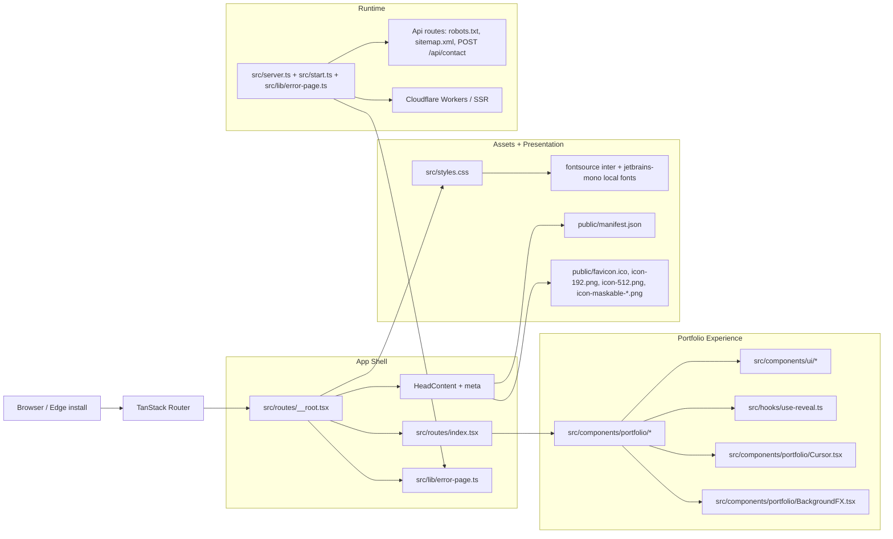

# Divyansh.dev

An interactive portfolio built to present my work, interests, and current focus through a strong visual identity and a lightweight, modern frontend stack.

This project is intentionally opinionated: it leans into a dark, terminal-inspired aesthetic, subtle motion, and focused section-based storytelling rather than a generic brochure layout.

## What This Project Shows

- A personal portfolio experience centered on projects, skills, experience, and current work
- A custom visual system with animated transitions, themed surfaces, and a tailored cursor treatment
- A compact content structure designed to keep the presentation clear without exposing unnecessary implementation detail

## Tech Stack

- React 19
- TypeScript
- TanStack Start / TanStack Router / React Query
- Vite
- Tailwind CSS v4
- Cloudflare Workers / Wrangler
- Self-hosted Inter + JetBrains Mono fonts via fontsource
- PWA manifest and install icons
- Radix UI (dialog) + Sonner (toasts)
- Lucide icons

## Getting Started

Requirements: [Bun](https://bun.sh) (or npm), Node 20+.

```bash
bun install        # install dependencies
bun run dev        # start the local dev server (with Cloudflare bindings)
bun run build      # production build (Cloudflare worker + client assets)
bun run preview    # preview the client build
bun run lint       # eslint + prettier checks (must pass before deploy)
bun run format     # prettier --write
```

## Tests

Vitest + Testing Library. Every source unit (lib, hooks, UI and portfolio components) has its own reusable test module under `tests/`, so you can run them individually after any change:

```bash
bun run test               # run the full suite once
bun run test:watch         # watch mode (recommended while developing)
bun run test:coverage      # run with v8 coverage report (coverage/ + terminal)
bun run test -- tests/lib # run one group, e.g. all lib tests
bun run test -- tests/components/portfolio/Nav.test.tsx # run a single module
bun run typecheck          # strict TS check (includes tests/)
```

Test suite layout:

- `tests/setup.ts` — shared jsdom mocks (IntersectionObserver, matchMedia, ResizeObserver) used by every module
- `tests/lib/` — `cn`, site config, error capture/TTL, error page output
- `tests/hooks/` — scroll-reveal behavior (stagger delays, intersection triggers)
- `tests/components/ui/` — Radix dialog and Sonner toaster wrappers
- `tests/components/portfolio/` — Nav, Hero, Projects & dialog flow, Contact form (fetch/toast), IntroBoot boot sequence, Cursor, BackgroundFX, and all content sections

The GitHub Actions workflow in `.github/workflows/ci.yml` runs lint + typecheck + tests + build on every push/PR. Deploys to Cloudflare Workers automatically via Cloudflare's built-in Git integration (no deploy workflow needed — every commit to the repo triggers it).

### Contact form (local)

The `/api/contact` endpoint needs a Resend API key. For local development:

1. `cp .dev.vars.example .dev.vars`
2. Fill in `RESEND_API_KEY` (and optionally `RESEND_FROM_EMAIL`).
3. Restart `bun run dev`.

Without the key the API returns `500 Email service is not configured` — the form will show a failure toast.

## Deployment (Cloudflare Workers)

The site runs as a Cloudflare Worker (SSR via TanStack Start on the Cloudflare adapter).

```bash
# 1. Set the secret for the contact form (one time)
wrangler secret put RESEND_API_KEY
wrangler secret put RESEND_FROM_EMAIL      # optional — verified sender, e.g. no-reply@divyansh.dev
wrangler secret put CONTACT_TO_EMAIL       # optional — delivery inbox

# 2. Deploy
bun run build && wrangler deploy
```

`wrangler deploy` uploads the worker built from `src/server.ts` (routes/robots.txt/sitemap.xml/contact API handled there) plus `dist/client` static assets. Custom domain and routes are configured in `wrangler.jsonc`.

Environment variables used at runtime:

| Variable                       | Default                 | Purpose                                                               |
| ------------------------------ | ----------------------- | --------------------------------------------------------------------- |
| `RESEND_API_KEY`               | —                       | Required. Resend API key for the contact form.                        |
| `RESEND_FROM_EMAIL`            | `onboarding@resend.dev` | Verified sender address. The default only delivers to your own inbox. |
| `CONTACT_TO_EMAIL`             | `yours.dev@email.com`   | Where contact messages are delivered.                                 |
| `CONTACT_RATE_LIMIT_MAX`       | `5`                     | Max contact submissions per IP per window.                            |
| `CONTACT_RATE_LIMIT_WINDOW_MS` | `600000` (10 min)       | Rate-limit window.                                                    |

## Architecture Snapshot



The structure keeps the visible portfolio content separate from the shared shell, asset pipeline, and runtime wiring, which makes the project easier to evolve while preserving the public-facing experience.

## Design Direction

The overall direction is modern, minimal, and technical:

- monochrome base palette with restrained accents
- terminal-like cursor and subtle hover responses
- layered glass and glow effects
- section-based narrative flow
- mobile-aware responsive layouts

## Focus

This repository is meant to represent my profile and work in a polished way, not to document every implementation detail or any sensitive feature set. The emphasis is on presentation, clarity, and a strong first impression while keeping private capabilities out of the public documentation.
