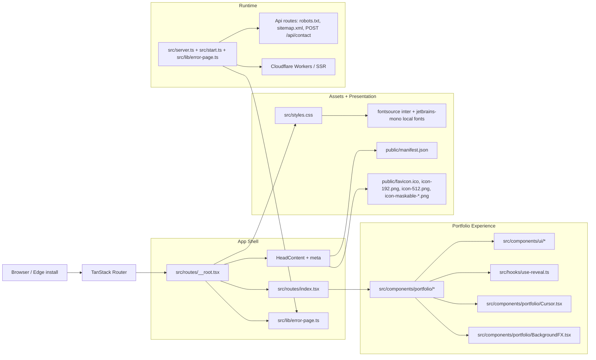

# Divyansh's Portfolio Website

An interactive portfolio built to present my work, interests, and current focus through a strong visual identity and a lightweight, modern frontend stack.

This project is intentionally opinionated: it leans into a dark, terminal-inspired aesthetic, subtle motion, and focused section-based storytelling rather than a generic brochure layout.

## What This Project Shows

- A personal portfolio experience centered on projects, skills, experience, and current work
- A custom visual system with animated transitions, themed surfaces, and a tailored cursor treatment
- A compact content structure designed to keep the presentation clear without exposing unnecessary implementation detail

## Tech Stack

- React 19
- TypeScript
- TanStack Start / TanStack Router / React Query
- Vite
- Tailwind CSS v4
- Cloudflare Workers / Wrangler
- Self-hosted Inter + JetBrains Mono fonts via fontsource
- PWA manifest and install icons
- Radix UI (dialog) + Sonner (toasts)
- Lucide icons

## Architecture Snapshot

The structure keeps the visible portfolio content separate from the shared shell, asset pipeline, and runtime wiring, which makes the project easier to evolve while preserving the public-facing experience.

## Design Direction

The overall direction is modern, minimal, and technical:

- monochrome base palette with restrained accents
- terminal-like cursor and subtle hover responses
- layered glass and glow effects
- section-based narrative flow
- mobile-aware responsive layouts

## Focus

This repository is meant to represent my profile and work in a polished way, not to document every implementation detail or any sensitive feature set. The emphasis is on presentation, clarity, and a strong first impression while keeping private capabilities out of the public documentation.
